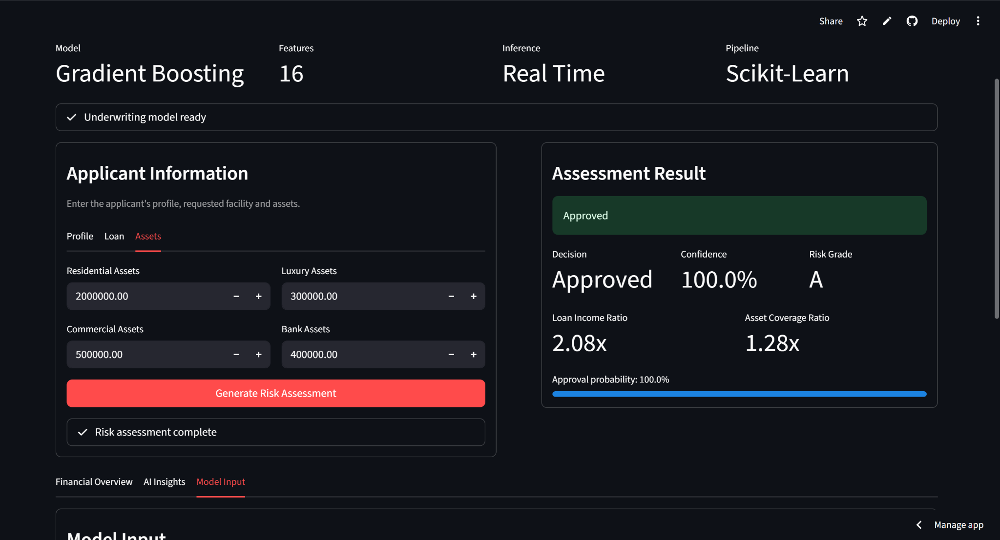

# 🏦 Lendora AI


### AI-Powered Loan Approval & Risk Assessment Platform

Lendora AI is a production-style fintech underwriting dashboard that performs real-time loan approval prediction using a pre-trained **Scikit-learn Pipeline** with a **Gradient Boosting Classifier**. The application automatically engineers financial features, estimates approval probability, assigns a risk grade, and generates rule-based underwriting insights through a clean Streamlit interface.

---

## 📸 Dashboard



---

## 🌐 Live Demo

**Application:**  
https://leondra-ai-chaqengyiqkmntktq7aeet.streamlit.app/

---

## ✨ Features

- Real-time loan approval prediction
- Production-style underwriting dashboard
- Gradient Boosting classifier
- Scikit-learn Pipeline inference
- Automatic financial feature engineering
- Approval probability estimation
- Risk grade generation
- Financial overview dashboard
- Rule-based AI insights
- Model input inspection
- Downloadable assessment report
- Robust error handling

---

## 🧠 Machine Learning Pipeline

### Model

- Gradient Boosting Classifier

### Framework

- Scikit-learn Pipeline

### Inference

- Real Time

### Total Features

The model predicts using **16 features**.

### Raw Features

- Number of Dependents
- Education
- Self Employed
- Annual Income
- Loan Amount
- Loan Term
- CIBIL Score
- Residential Assets
- Commercial Assets
- Luxury Assets
- Bank Assets

### Engineered Features

The application automatically computes:

- Total Assets
- Monthly Income
- Loan Income Ratio
- Asset Coverage Ratio
- EMI Proxy

No manual calculation is required before prediction.

---

## 🏗 System Architecture

The application follows a clear inference pipeline from applicant data collection to model prediction and reporting.

```mermaid
flowchart LR
    A[Applicant Inputs] --> B[Validation]
    B --> C[Feature Engineering]
    C --> D[Scikit-learn Pipeline]
    D --> E[Gradient Boosting]
    E --> F[Approval Probability]
    F --> G[Decision and Risk Grade]
    G --> H[Insights and Report]## 🛠 Technology Stack

| Category | Technology |
|----------|------------|
| Language | Python |
| Framework | Streamlit |
| Machine Learning | Scikit-learn |
| Model | Gradient Boosting |
| Data Processing | Pandas |
| Model Serialization | Joblib |

---

## 📂 Repository Structure

```text
.
├── app.py
├── loan_pipeline.pkl
├── loan_approval_prediction.ipynb
├── dashboard.png
├── requirements.txt
└── README.md
```

---

## 🚀 Run Locally

Clone the repository

```bash
git clone https://github.com/YOUR_USERNAME/YOUR_REPOSITORY.git
```

Move into the project directory

```bash
cd YOUR_REPOSITORY
```

Install dependencies

```bash
pip install -r requirements.txt
```

Run the application

```bash
streamlit run app.py
```

---

## 📊 Dashboard Capabilities

The application provides:

- Applicant profile collection
- Loan information management
- Asset portfolio analysis
- Automatic feature engineering
- Real-time prediction
- Approval confidence
- Risk grading
- Financial metrics
- Asset comparison chart
- AI-generated underwriting insights
- Downloadable prediction report

---

## 🎯 Business Use Case

This project simulates an internal loan underwriting application used by financial institutions to evaluate applicant affordability, collateral strength, leverage, and repayment capacity before approving loans.

---

## 🔮 Future Improvements

- SHAP Explainability
- MLflow Experiment Tracking
- Docker Support
- FastAPI Backend
- Authentication
- Database Integration
- Prediction History
- Model Monitoring
- Drift Detection
- CI/CD Pipeline using GitHub Actions

---

## ⚠ Disclaimer

This project is developed for educational and portfolio purposes only.

It is not intended to replace real-world financial underwriting systems. Production lending systems require secure infrastructure, regulatory compliance, fairness evaluation, explainability, identity verification, and human oversight before making lending decisions.

---

## 👨‍💻 Author

**Mahek Advani**

GitHub: https://github.com/mahek12345678
