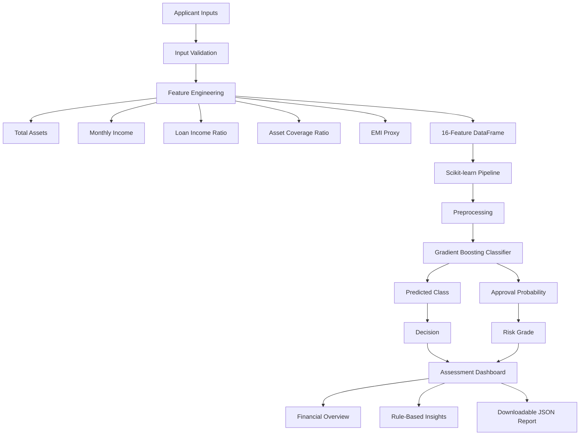

# Lendora AI System Architecture

```mermaid
flowchart TD
    A[Applicant Inputs] --> B[Input Validation]
    B --> C[Feature Engineering]

    C --> C1[Total Assets]
    C --> C2[Monthly Income]
    C --> C3[Loan Income Ratio]
    C --> C4[Asset Coverage Ratio]
    C --> C5[EMI Proxy]

    C --> D[16-Feature DataFrame]
    D --> E[Scikit-learn Pipeline]
    E --> F[Preprocessing]
    F --> G[Gradient Boosting Classifier]

    G --> H[Predicted Class]
    G --> I[Approval Probability]

    H --> J[Decision]
    I --> K[Risk Grade]

    J --> L[Assessment Dashboard]
    K --> L

    L --> M[Financial Overview]
    L --> N[Rule-Based Insights]
    L --> O[Downloadable JSON Report]
```
